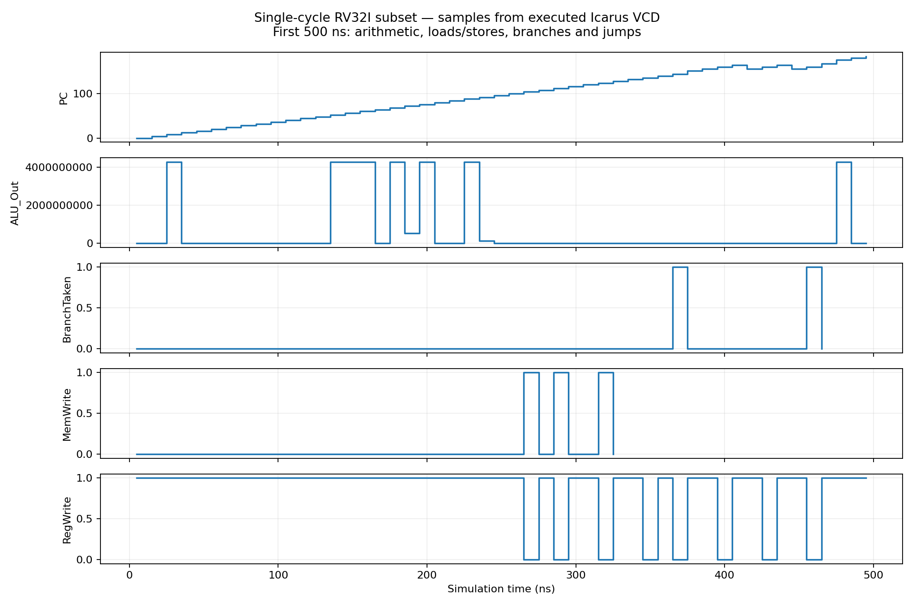

# Single-Cycle RISC-V Processor Core

A synthesizable educational single-cycle processor written in Verilog RTL,
implementing **23 instructions from RV32I**. Fetch, decode, execute, memory access,
and write-back are combinational paths between clock edges, not pipeline stages.
One valid instruction completes per cycle; the maximum clock speed is limited
by the longest complete instruction path.

**Validated here:** Icarus simulation and Yosys generic synthesis.
See [verification report](docs/VERIFICATION.md).



## Instructions

| Class | Instructions |
|---|---|
| Register ALU | ADD, SUB, AND, OR, XOR, SLL, SRL, SRA, SLT, SLTU |
| Immediate ALU | ADDI, ANDI, ORI, XORI, SLLI, SRLI, SRAI, SLTI, SLTIU |
| Memory | LW, SW |
| Control flow | BEQ, JAL |

Not a complete RV32I implementation: no other branches, byte/halfword accesses,
LUI, AUIPC, JALR, FENCE, ECALL/EBREAK, CSRs, interrupts or privilege modes.
There is no condition-code register; BEQ directly compares register operands.

## Architecture

- PC resets to zero and selects PC+4, PC-relative BEQ target, or JAL target.
- 32 × 32-bit register file: two asynchronous reads, one synchronous write;
  x0 always reads zero and discards writes.
- Separate instruction ROM (256 words) and data memory (64 words).
- Byte addresses, indexed by address[31:2]; accesses must be word-aligned.
- I/S/B/J immediate extraction with sign extension.
- ALU supports logic, arithmetic, shifts and signed/unsigned comparison.
- Control unit decodes opcode, funct3 and the complete funct7 where relevant.
- JAL writes PC+4 to rd. Loads use the data-memory write-back mux.
- Illegal encodings, invalid fetches, misaligned taken targets and invalid data
  accesses assert `fault`, freeze the PC, and suppress register/memory writes.
  This is a simple halt policy, not architectural RISC-V exception handling.
- Asynchronous active-high reset clears PC, registers and data memory. ROM is
  loaded using `$readmemh` and is not cleared by reset.

## Folder layout

```
rtl/Single_Cycle.v       Synthesizable core and component modules
sim/tb_single_cycle.v   Self-checking testbench
sim/programs/           Machine-code program, annotated listing, reference vectors
tools/                  Python encoder/reference, simulation and synthesis scripts
results/                Executed logs, waveform and generated outputs
docs/                   Verification report and change notes
LICENSE                 Original MIT license
```

## Run (Linux / WSL)

Install Python 3, Icarus Verilog, Yosys and optionally GTKWave/Verilator.
From this folder:

```bash
make sim
make synth
make lint            # optional Verilator lint
# Open waveform, expand tb_single_cycle.dut and add PC, instruction,
# ALU_Out, writeback, RegWrite, MemWrite, BranchTaken, fault:
gtkwave results/core.vcd
```

`tools/make_program.py` regenerates the demonstration and reference vectors,
using a fixed random seed. The testbench compares per-cycle PC, next PC,
write-back and stores against an independent architectural interpreter, then
checks every register and memory word. Tests include negative immediates,
arithmetic versus logical right shift, signed versus unsigned comparisons,
x0 protection, both BEQ outcomes, a backward loop and JAL links.
Invalid accesses and encodings are tested separately. This is directed and
seeded regression coverage, not formal verification or an ISA compliance suite.

To run your own software, provide a word-per-line hexadecimal program and set
`PROGRAM_FILE`. The supplied regression vectors apply only to the supplied
program. `demo.asm` is an annotated tuple listing, not GNU assembler input;
no cross-compiler is required.

## Other tools

RTL is Verilog-2005; testbench uses SystemVerilog constructs (`-g2012`).
ModelSim/Questa recipe (provided, not validated here):

```tcl
vlib work
vlog -sv +incdir+. rtl/Single_Cycle.v sim/tb_single_cycle.v
vsim -c work.tb_single_cycle -do "run -all; quit -f"
```

Vivado generic synthesis script (provided, not validated here):

```bash
vivado -mode batch -source tools/vivado.tcl -tclargs xc7a100tcsg324-1
```

Run all tools from this project root so ROM paths resolve. Verilator lint can
report multi-module filename/unused signal warnings; it does not execute the
testbench. See `docs/VERIFICATION.md` for actual completed validation.

## FPGA limitations

Asynchronous reads and reset of every data-memory word favor flip-flop/distributed
memory implementation, rather than synchronous block RAM. This is appropriate
for a small educational single-cycle design. No board pin constraints, clock
constraints, timing closure, hardware programming or measured Fmax are claimed.
The Vivado script performs synthesis only. Adapt memories and timing architecture
before building a larger FPGA processor.
